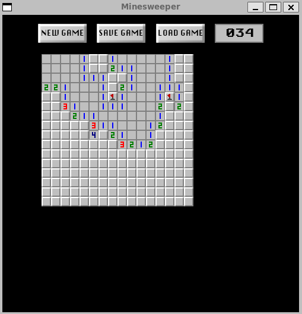

# minesweeper
An object oriented recreation of classic Minesweeper using SFML and C++. In addition to the features of classic Minewseeper, save states and custom boards have been added. Follow in-game prompts to learn how to play.

